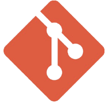

</a>

<br/>
<br/>

# 1. Project Overview (프로젝트 개요)

- 프로젝트 이름: Hi!
- 프로젝트 설명: Likelion Ui 프로젝트

<br/>
<br/>
****
# 2. Team Members (팀원 및 팀 소개)

|                 이훈진                  |               배동초               |                배희정                |                  강석현                  |
| :-------------------------------------: | :--------------------------------: | :----------------------------------: | :--------------------------------------: |
|                   FE                    |                 FE                 |                  FE                  |                    FE                    |
| [GitHub](https://github.com/huniversal) | [GitHub](https://github.com/sua17) | [GitHub](https://github.com/hjb0304) | [GitHub](https://github.com/Kanghyeon00) |

<br/>
<br/>

# 3. Key Features (주요 페이지)

- **메인 페이지**:
- **팀 소개 페이지**:
- **프로젝트 플랜 페이지**:
- **로그인 페이지**:
- **회원가입 페이지**:

<br/>
<br/>

# 4. Tasks & Responsibilities (작업 및 역할 분담)

|        |                                                      |
| ------ | ---------------------------------------------------- |
| 이훈진 | <ul><li>메인 페이지</li><li>팀 소개 페이지</li></ul> |
| 배동초 | <ul><li>메인 페이지</li><li>팀 소개 페이지</li></ul> |
| 배희정 | <ul><li>메인 페이지</li></ul>                        |
| 강석현 | <ul><li>로그인, 회원가입 페이지</li></ul>            |

<br/>
<br/>

# 5. Technology Stack (기술 스택)

## 5.1 Language

|                                                                           |                                                                                     |
| ------------------------------------------------------------------------- | ----------------------------------------------------------------------------------- |
| HTML5                                                                     | Tailwind CSS                                                                        |
|  |  |

<br/>

## 5.4 Cooperation

|         |                                                                                |
| ------- | ------------------------------------------------------------------------------ |
| Git     |          |
| GitHub  |    |
| Notion  |    |
| Discord |  |

<br/>

# 6. Project Structure (프로젝트 구조)

```plaintext
project/
├── public/
│   ├── index.html           # HTML 템플릿 파일
│   └── favicon.ico          # 아이콘 파일
├── src/
│   ├── assets/              # 이미지, 폰트 등 정적 파일
│   ├── pages/               # 각 페이지별 컴포넌트
│   package-lock.json        # 정확한 종속성 버전이 기록된 파일로, 일관된 빌드를 보장
│   package.json             # 프로젝트 종속성 및 스크립트 정의
├── .gitignore               # Git 무시 파일 목록
└── README.md                # 프로젝트 개요 및 사용법
```

<br/>
<br/>

# 7. Coding Convention

## 문장 종료

```
// 세미콜론(;)
console.log("Hello World!");
```

<br/>
<br/>

# 8. 커밋 컨벤션

## 기본 구조

```
type : subject

body
```

<br/>
# 🚀 Gitmoji 가이드

## 🟦 type 종류

- `feat` : 새로운 기능 추가
- `fix` : 버그 수정
- `docs` : 문서 수정
- `style` : 코드 포맷팅, 세미콜론 누락, 코드 변경이 없는 경우
- `refactor` : 코드 리팩토링
- `test` : 테스트 코드, 리팩토링 테스트 코드 추가
- `chore` : 빌드 업무 수정, 패키지 매니저 수정

---

## 🟦 커밋 이모지 가이드

| 이모지 | 설명                                        | Gitmoji 코드 형식 |
| :----: | :------------------------------------------ | :---------------- |
|   🎉   | 초기 설정 (Init)                            | `:tada:`          |
|   🎨   | 기능 추가, 변경 (Feat)                      | `:art:`           |
|   🔥   | 파일이나 코드 삭제 (Remove)                 | `:fire:`          |
|   🐛   | 버그, 오류 수정 (Fix)                       | `:bug:`           |
|   ✏️   | 단순 오타 수정 (Typo)                       | `:pencil:`        |
|   📝   | 문서 관련 수정 (Docs)                       | `:memo:`          |
|   💄   | CSS 등 사용자 UI 디자인 변경 (Style)        | `:lipstick:`      |
|   ♻️   | 코드 리팩토링 (Refactor)                    | `:recycle:`       |
|   🧪   | 테스트 코드 추가, 삭제, 변경 (Test)         | `:test_tube:`     |
|   🏇   | npm 모듈 설치 등 (Ci)                       | `:racehorse:`     |
|   🍱   | asset 파일 (이미지, 아이콘 등) 추가 (Asset) | `:bento:`         |
|   🐳   | 패키지 매니저 설정, etc (Chore)             | `:whale:`         |

---

## 🟦 사용 예시

```bash
git commit -m "✨ feat: 사용자 로그인 기능 추가"
git commit -m "🐛 fix: 로그인 시 비밀번호 검증 오류 수정"
git commit -m "📝 docs: README.md 수정"
****

## 커밋 예시
✨Feat: "회원 가입 페이지 구현"

```
